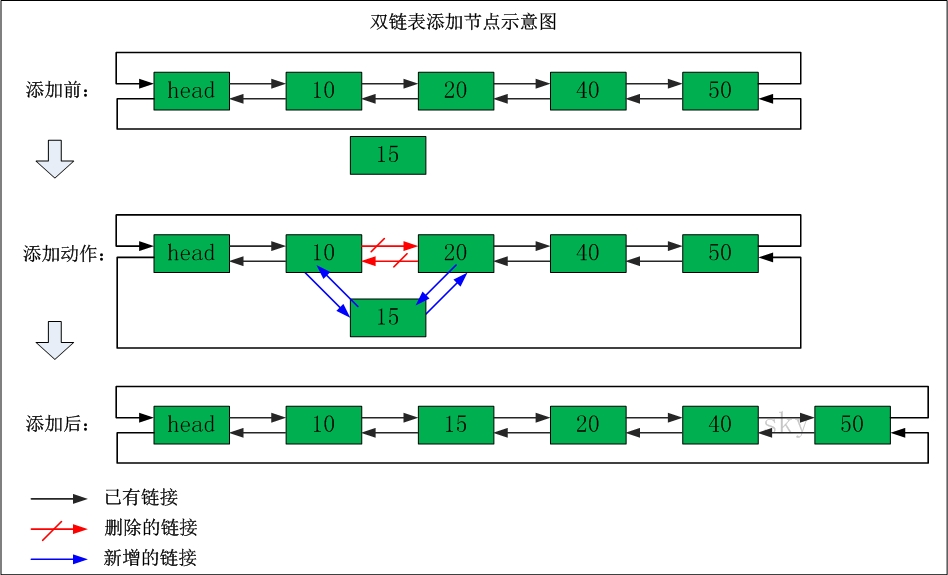

双链表
-------
说明：双向链表(双链表)是链表的一种。和单链表一样，双链表也是由节点组成，它的每个数据结点中都有两个指针，分别指向直接后继和直接前驱。所以，从双向链表中的任意一个结点开始，都可以很方便地访问它的前驱结点和后继结点。一般我们都构造双向循环链表。  

### 双链表的示意图如下：  
  
- 表头为空，表头的后继节点为"节点10"(数据为10的节点)；
- "节点10"的后继节点是"节点20"(数据为10的节点)，"节点20"的前继节点是"节点10"；
- "节点20"的后继节点是"节点30"，"节点30"的前继节点是"节点20"；...；
- 末尾节点的后继节点是表头。  

### 双链表删除节点:  

- 删除"节点30"
- 删除之前："节点20"的后继节点为"节点30"，"节点30" 的前继节点为"节点20"。"节点30"的后继节点为"节点40"，"节点40" 的前继节点为"节点30"。
- 删除之后："节点20"的后继节点为"节点40"，"节点40" 的前继节点为"节点20"。

### 双链表添加节点：

- 在"节点10"与"节点20"之间添加"节点15"
- 添加之前："节点10"的后继节点为"节点20"，"节点20" 的前继节点为"节点10"。
- 添加之后："节点10"的后继节点为"节点15"，"节点15" 的前继节点为"节点10"。"节点15"的后继节点为"节点20"，"节点20" 的前继节点为"节点15"。
