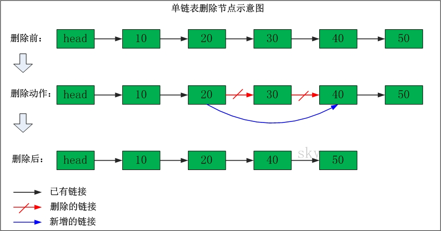

1.数组
----------
数组有上界和下界，数组的元素在上下界内是连续的。  

#### 存储10,20,30,40,50的数组的示意图如下：

- 数组的特点是：数据是连续的；随机访问速度快。
- 数组中稍微复杂一点的是多维数组和动态数组。对于C语言而言，多维数组本质上也是通过一维数组实现的。至于动态数组，是指数组的容量能动态增长的数组；对于C语言而言，若要提供动态数组，需要手动实现；而对于C++而言，STL提供了Vector；对于Java而言，Collection集合中提供了ArrayList和Vector  

2.单向链表
-----------
单向链表(单链表)是链表的一种，它由节点组成，每个节点都包含下一个节点的指针。  

##### 2.1单链表的示意图如下：

表头为空，表头的后继节点是"节点10"(数据为10的节点)，"节点10"的后继节点是"节点20"(数据为10的节点)，...

#### 2.2单链表删除节点:

- 删除"节点30"
- 删除之前："节点20" 的后继节点为"节点30"，而"节点30" 的后继节点为"节点40"。
- 删除之后："节点20" 的后继节点为"节点40"。

#### 2.3单链表添加节点

- 在"节点10"与"节点20"之间添加"节点15"
- 添加之前："节点10" 的后继节点为"节点20"。
- 添加之后："节点10" 的后继节点为"节点15"，而"节点15" 的后继节点为"节点20"。
- 单链表的特点是：节点的链接方向是单向的；相对于数组来说，单链表的的随机访问速度较慢，但是单链表删除/添加数据的效率很高。

#### 2.4双链表请参考
[双链表的操作](./double_link.md)
