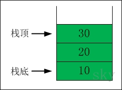

栈
-------------

### 介绍
- 栈（stack），是一种线性存储结构，它有以下几个特点：
- 栈中数据是按照"后进先出（LIFO, Last In First Out）"方式进出栈的。
- 向栈中添加/删除数据时，只能从栈顶进行操作。  

栈通常包括的三种操作：push，peek，pop。
1. push -- 向栈中添加元素。
2. peek -- 返回栈顶元素。
3. pop  -- 返回并删除栈顶元素的操作。

### 栈的示意图

栈中的数据依次是 30 --> 20 --> 10

### 出栈

- 出栈前：栈顶元素是30。此时，栈中的元素依次是 30 --> 20 --> 10
- 出栈后：30出栈之后，栈顶元素变成20。此时，栈中的元素依次是 20 --> 10

### 入栈

- 入栈前：栈顶元素是20。此时，栈中的元素依次是 20 --> 10
- 入栈后：40入栈之后，栈顶元素变成40。此时，栈中的元素依次是 40 --> 20 --> 10

###代码
[栈实现代码](../c_source/stack/array_stack.c):只能存储int类型。
[单向链表实现栈代码](../c_source/stack/slink_stack.c):只能存储int类型。